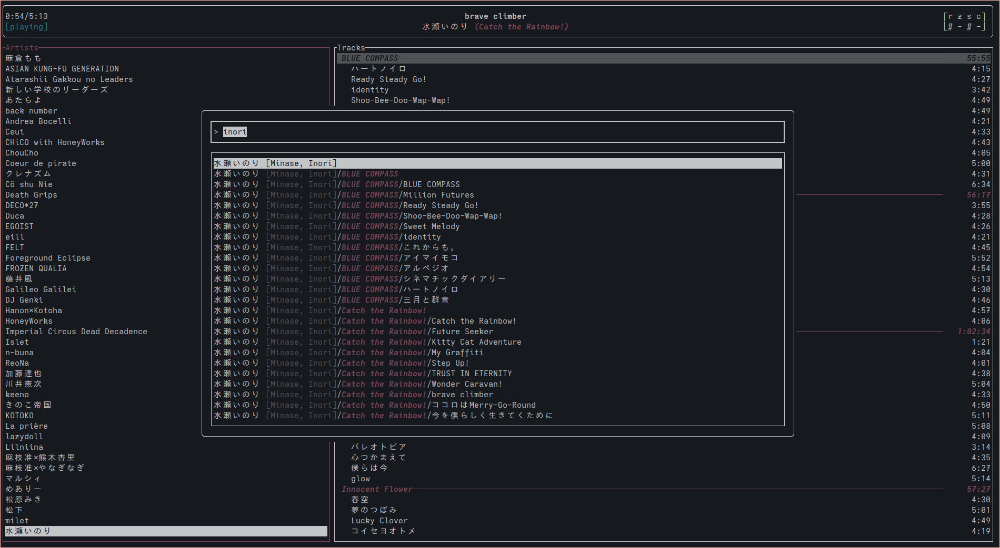

# inori

  
    <picture>
      <source
        media="(prefers-color-scheme: light)"
        srcset="https://github.com/eshrh/inori/raw/HEAD/images/inori-logo.svg"
      />
      <source
        media="(prefers-color-scheme: dark)"
        srcset="https://github.com/eshrh/inori/raw/HEAD/images/inori-logo-white.svg"
      />
      
    </picture>
  

Client for the Music Player Daemon ([MPD](https://www.musicpd.org/)).

## Features

- Fuzzy search everywhere with
  [nucleo](https://github.com/helix-editor/nucleo)
  - Fully unicode aware, with special attention to the "albumartistsort"
    field
  - Global search across all tracks, albums, and artists
- Folding library interface inspired by [cmus](https://cmus.github.io/)
- Queue viewer and manipulation interface
- Configurable, chainable keybindings

## Installation & Usage
Inori is on crates.io: `cargo install inori`.

Inori is also available on:
- AUR as [inori](https://aur.archlinux.org/packages/inori) [maintained by @eshrh].
- Nixpkgs unstable as [inori](https://github.com/NixOS/nixpkgs/blob/nixos-unstable/pkgs/by-name/in/inori/package.nix) [maintained by @stephen-huan and @esrh]

See [configuration.md](./CONFIGURATION.md) for config options, as well
as a full list of all default keybindings.

## Screenshots

## Todo

- [ ] Playlist interface
- [ ] Compile feature flag for Japanese album/track title romanization for search using a tokenizer & dictionary
- [ ] More thorough customization options, especially for behavior & layout tweaks
- [ ] Spectrum visualizer like ncmpcpp

## Acknowledgements

- authors of [ratatui](https://ratatui.rs/) and
  [rust-mpd](https://docs.rs/mpd/latest/mpd/)
- [mmtc](https://github.com/figsoda/mmtc) and
  [rmptui](https://github.com/krolyxon/rmptui), two other rust mpd
  clients, helped me learn rust
- [@stephen-huan](https://github.com/stephen-huan): here from day one
